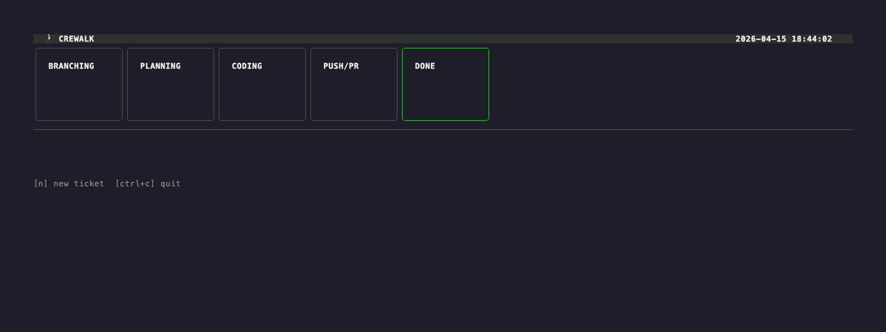

# crewalk

Watch your Claude Code sessions walk through work stages — in real time.

[](https://github.com/currenjin/crewalk/releases)
[](https://go.dev/)
[](LICENSE)

[English](#english) | [한국어](#한국어)



---

<a name="english"></a>

## Why crewalk?

Running multiple Claude Code sessions in parallel is powerful — but invisible. crewalk puts them on screen: each ticket becomes a character, each workflow stage becomes a room, and you watch your crew walk from planning to done.

## Prerequisites

- [Claude Code](https://claude.ai/code) (`claude` in PATH)
- git
- [tmux](https://github.com/tmux/tmux) (`brew install tmux`)

## Installation

```bash
curl -fsSL https://raw.githubusercontent.com/currenjin/crewalk/main/install.sh | sh
```

Custom install directory:

```bash
CREWALK_INSTALL_DIR=~/.local/bin curl -fsSL https://raw.githubusercontent.com/currenjin/crewalk/main/install.sh | sh
```

Build from source (requires Go):

```bash
go install github.com/currenjin/crewalk/cmd/crewalk@latest
```

### Uninstall

```bash
curl -fsSL https://raw.githubusercontent.com/currenjin/crewalk/main/uninstall.sh | sh
```

## Usage

Run from inside your git project:

```bash
cd /path/to/your/project
crewalk
```

crewalk auto-detects the project root by walking up to find `.git`. No configuration needed for basic use.

### Key bindings

| Key | Action |
|-----|--------|
| `n` | Open new ticket input |
| `Enter` | Confirm input |
| `Esc` | Cancel input |
| `Ctrl+C` | Quit |

When answering a question:

| Key | Action |
|-----|--------|
| `↑` / `↓` | Navigate options |
| `Tab` | Toggle between select and free-text mode |
| any key | Auto-switch to free-text mode and type |
| `Enter` | Submit answer |

### Starting a ticket

1. Press `n`
2. Type a ticket ID (e.g. `RP-1234`)
3. Press `Enter`

crewalk creates a git worktree, spawns a Claude Code session, and injects `/work RP-1234` to start the work session. The character appears and begins walking through stages as Claude works.

### Answering questions

When Claude needs input, the character pauses and a question box appears at the bottom of the screen. Use `↑`/`↓` to pick from available options, or press `Tab` (or just start typing) to switch to free-text input. Press `Enter` to confirm. If multiple tickets are asking questions simultaneously, they queue up — one at a time, in order.

## Configuration

crewalk works without any config file. To override defaults, create `~/.config/crewalk/config.toml`:

```toml
[project]
path = "/path/to/your/project"
worktree_base = "/path/to/worktrees"

[claude]
command = "claude"
args = ["--dangerously-skip-permissions"]
```

| Field | Default | Description |
|-------|---------|-------------|
| `project.path` | auto-detected from `.git` | Absolute path to your project root |
| `project.worktree_base` | `../worktree` relative to project root | Where git worktrees are created |
| `claude.command` | `claude` | Claude Code binary name or path |
| `claude.args` | `["--dangerously-skip-permissions"]` | Arguments passed to every Claude session |

## How it works

- Each ticket gets its own git worktree under `worktree_base/feature/<ticket-id>`
- Claude Code runs in a hidden detached tmux session (`crewalk-<ticket-id>`) — no extra window opens
- crewalk watches `~/.claude/projects/*/*.jsonl` transcripts to detect phase transitions and questions
- When Claude asks a question, the TUI shows it and sends your answer via `tmux send-keys`
- Phase changes animate the character walking to the next room
- On quit, all sessions are gracefully shut down and worktrees are removed

## Workflow stages

| Stage | Description |
|-------|-------------|
| PLANNING | Claude is reading the ticket and planning the approach |
| BRANCHING | Creating the git branch |
| CODING | Implementing the changes |
| REVIEWING | Running tests, reviewing the diff |
| PUSH/PR | Pushing and opening a pull request |
| DONE | Work complete |

---

<a name="한국어"></a>

# crewalk (한국어)

Claude Code 세션이 작업 단계를 걸어가는 모습을 실시간으로 지켜보세요.


## 왜 crewalk인가?

여러 Claude Code 세션을 병렬로 돌리는 건 강력하지만, 눈에 보이지 않습니다. crewalk는 그걸 화면에 올려놓습니다. 각 티켓은 캐릭터가 되고, 각 워크플로우 단계는 방이 되고, 크루가 계획에서 완료까지 걷는 모습을 지켜봅니다.

## 사전 요구사항

- [Claude Code](https://claude.ai/code) (PATH에 `claude` 명령어 사용 가능)
- git
- [tmux](https://github.com/tmux/tmux) (`brew install tmux`)

## 설치

```bash
curl -fsSL https://raw.githubusercontent.com/currenjin/crewalk/main/install.sh | sh
```

설치 디렉토리를 바꾸고 싶다면:

```bash
CREWALK_INSTALL_DIR=~/.local/bin curl -fsSL https://raw.githubusercontent.com/currenjin/crewalk/main/install.sh | sh
```

소스에서 직접 빌드 (Go 필요):

```bash
go install github.com/currenjin/crewalk/cmd/crewalk@latest
```

### 제거

```bash
curl -fsSL https://raw.githubusercontent.com/currenjin/crewalk/main/uninstall.sh | sh
```

## 사용법

git 프로젝트 내부에서 실행합니다:

```bash
cd /path/to/your/project
crewalk
```

crewalk는 `.git` 디렉토리를 찾아 올라가며 프로젝트 루트를 자동으로 감지합니다. 기본 사용에는 별도 설정이 필요 없습니다.

### 키바인딩

| 키 | 동작 |
|----|------|
| `n` | 새 티켓 입력 열기 |
| `Enter` | 입력 확인 |
| `Esc` | 입력 취소 |
| `Ctrl+C` | 종료 |

질문에 답할 때:

| 키 | 동작 |
|----|------|
| `↑` / `↓` | 선택지 이동 |
| `Tab` | 선택 모드 / 직접 입력 모드 전환 |
| 아무 키나 | 자동으로 직접 입력 모드로 전환 |
| `Enter` | 답변 제출 |

### 티켓 시작하기

1. `n` 키를 누릅니다
2. 티켓 ID를 입력합니다 (예: `RP-1234`)
3. `Enter`를 누릅니다

crewalk가 git worktree를 생성하고 Claude Code 세션을 실행한 뒤 `/work RP-1234`를 주입해 작업을 시작합니다. 캐릭터가 나타나고 Claude가 작업하는 동안 단계를 걸어갑니다.

### 질문 답하기

Claude가 입력이 필요하면 캐릭터가 멈추고 화면 하단에 질문 박스가 나타납니다. `↑`/`↓`로 선택지를 고르거나, `Tab` (또는 바로 타이핑)으로 직접 입력 모드로 전환할 수 있습니다. `Enter`로 제출합니다. 여러 티켓이 동시에 질문하는 경우 순서대로 한 번에 하나씩 처리합니다.

## 설정

설정 파일 없이도 동작합니다. 기본값을 변경하려면 `~/.config/crewalk/config.toml`을 만드세요:

```toml
[project]
path = "/path/to/your/project"
worktree_base = "/path/to/worktrees"

[claude]
command = "claude"
args = ["--dangerously-skip-permissions"]
```

| 필드 | 기본값 | 설명 |
|------|--------|------|
| `project.path` | `.git`으로 자동 감지 | 프로젝트 루트 절대 경로 |
| `project.worktree_base` | 프로젝트 루트 기준 `../worktree` | git worktree가 생성될 경로 |
| `claude.command` | `claude` | Claude Code 바이너리 이름 또는 경로 |
| `claude.args` | `["--dangerously-skip-permissions"]` | 모든 Claude 세션에 전달되는 인수 |

## 동작 원리

- 각 티켓은 `worktree_base/feature/<ticket-id>` 경로에 독립된 git worktree를 가집니다
- Claude Code는 hidden detached tmux 세션(`crewalk-<ticket-id>`)에서 실행됩니다 — 별도 창이 열리지 않습니다
- crewalk가 `~/.claude/projects/*/*.jsonl` 트랜스크립트를 감시해 단계 전환과 질문을 감지합니다
- Claude가 질문하면 TUI에 표시되고, 답변은 `tmux send-keys`로 전달됩니다
- 단계가 바뀌면 캐릭터가 다음 방으로 걸어가는 애니메이션이 재생됩니다
- 종료 시 모든 세션이 정상 종료되고 worktree가 삭제됩니다

## 워크플로우 단계

| 단계 | 설명 |
|------|------|
| PLANNING | 티켓을 읽고 접근 방식을 계획하는 중 |
| BRANCHING | git 브랜치 생성 중 |
| CODING | 변경 사항 구현 중 |
| REVIEWING | 테스트 실행, diff 검토 중 |
| PUSH/PR | 푸시 및 Pull Request 생성 중 |
| DONE | 작업 완료 |
